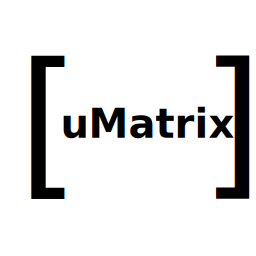

# uMatrix
uMatrix is a Matrix protocol client for Ubuntu Touch.

To know more about Matrix go to https://matrix.org/

The application makes use of the libqmatrixclient developed by Felix Rohrbach kde@fxrh.de and others. The source code can be found in https://github.com/QMatrixClient/libqmatrixclient

This application also takes important parts of the code base of Tensor by David A. Roberts, Roman Plášil and others. The source code of tensor can be found in https://github.com/davidar/tensor

## Pre-requisites
Ubunu-SDK (this section will vary with the clickable environment inclusion).

## Building
This code should compile in the ubuntu sdk. The building istructions for the clickable environment will be released soon.

## Installation
There are different ways to install this app in a phone.

- Use the Ubuntu-SDK to install the created click package.
- Send to yourself the click package over wire, or over telegram, and open the file with the OpenStore app.
-more soon...

## App development
This is the initial release of the uMatrix app. There are several things to improve, both in the usability as in the features side.

In this moment, you can not create a new user within the app. In order to do so, go to https://riot.im/app .
